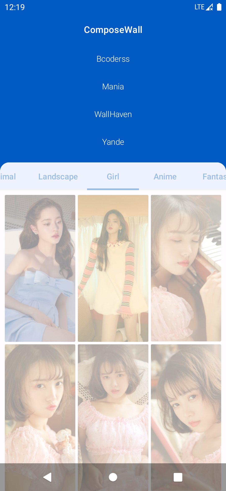

# ComposeWall

Compose wall is a wallpaper app built fully
with [Jetpack Compose](https://developer.android.com/jetpack/compose).

### Screenshots

  

### Who could learn this repo?

Both Android beginners and experienced developers could learn learn this repo.

### Why choose this repo?

You should also checkout [Compose samples](https://github.com/android/compose-samples), but IMO they
are more difficult to learn than this repo. If you have any questions, please create an issue, I
will help to the best of my ability.

### Structure of this repo?

- `data` is for model class and parsers are used to parse image source url from web pages.
- `net` is for net request apis and services.
- `component` is the encapsulation of Compose ui components.
- `theme` is for colors, font styles, and themes.
- `AppMenu` defines all menus of app.
- `ComposeNavGraph` is like Jetpack navigation, it defines destinations of app.
- `ComposeDestinations` is actually holding navigating methods for different status.

